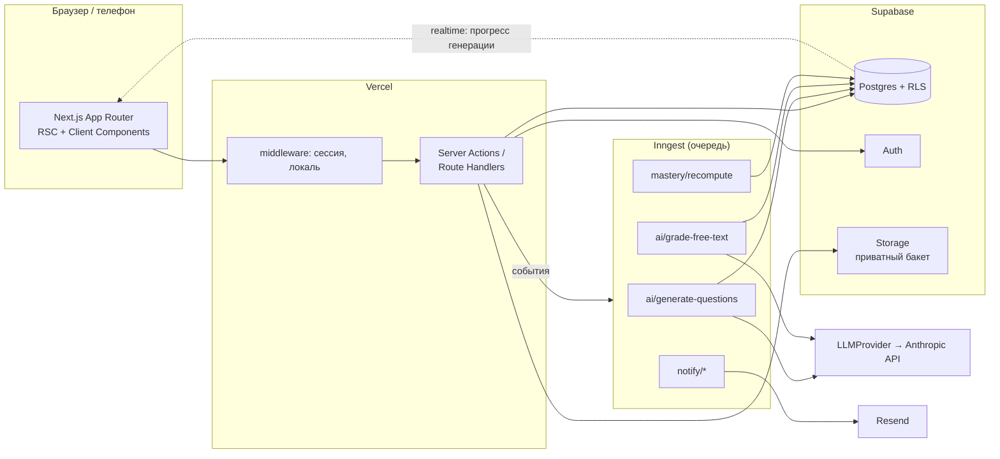

# Архитектура TutorLab

Платформа для одного репетитора (позже — небольшой команды): ученики 6–11 классов, госпрограмма и SAT. Ядро: генерация заданий под тему и уровень, автопроверка, карта усвоения, рекомендация «что дальше».

## 1. Выбор стека и обоснование

| Слой | Выбор | Почему именно это |
|---|---|---|
| Приложение | **Next.js 15 (App Router) + TypeScript** | Один репозиторий на фронт и бэк, Server Actions и Route Handlers, общие типы и Zod-схемы между клиентом и сервером. Самая большая экосистема, ИИ-ассистент знает её API. |
| БД и доступ | **Supabase (Postgres 16) + Row Level Security** | Реляционная БД с политиками доступа на уровне строк «из коробки»: ученик физически не прочитает чужую попытку, даже если в коде ошибка. Auth, Storage с подписанными ссылками и Realtime в одном сервисе. |
| ORM и миграции | **Drizzle ORM + drizzle-kit** | Схема на TypeScript, миграции в SQL под контролем версий, откат через down-скрипты. Типы таблиц выводятся из схемы, никакой ручной дупликации. |
| Аутентификация | **Supabase Auth** | Email + пароль, magic link, Google OAuth без своей криптографии и своих сессий. Роли храним в `memberships`, прокидываем в JWT-клеймы для RLS. |
| Валидация | **Zod** | Одни схемы для форм, API и ответов ИИ. Ответ модели парсится строго по схеме, свободный текст не принимается. |
| UI | **Tailwind CSS + shadcn/ui (Radix) + lucide-react** | Доступные примитивы (фокус, aria, клавиатура) без написания своих. Токены дизайн-системы — в CSS-переменных, светлая и тёмная тема. |
| Формулы | **KaTeX** | Быстрый синхронный рендер LaTeX на клиенте и сервере, превью в редакторе. |
| i18n | **next-intl** | Словари `messages/{ru,en,uz}.json`, строгая типизация ключей, никакого хардкода в компонентах. |
| Фоновые задачи | **Inngest** | Очереди с ретраями, шагами и прогрессом без своего воркера; работает на Vercel serverless. Бесплатный тариф покрывает MVP. Абстрагирован в `/jobs`, замена на pg-boss при переезде на свой сервер — одна папка. |
| ИИ | **Anthropic SDK за интерфейсом `LLMProvider`** | Смена модели или провайдера — правка конфига. Промпты в `prompts/*.md` с версией. Structured output через Zod-схему и повторный парс. |
| Почта | **Resend + React Email** | Транзакционные письма из тех же компонентов, бесплатный тариф 3 000 писем в месяц. |
| Тесты | **Vitest** (unit, integration) + **Playwright** (e2e) | Стандарт для Next.js; Vitest запускает TS без сборки. |
| Хостинг | **Vercel Hobby + Supabase Free** на старте | Ноль рублей до первых десятков учеников. Путь роста: Vercel Pro + Supabase Pro, без смены кода. |
| CI | **GitHub Actions** | lint, typecheck, unit, integration на каждый push; e2e на PR в main. |

Правило при сомнениях: выбран более скучный и распространённый вариант. Ни одной библиотеки без реальной задачи.

Известные ограничения бесплатных тарифов (учтены в дизайне): Supabase Free ставит проект на паузу после недели без запросов — пингуем cron-задачей Inngest раз в сутки; лимит 500 МБ БД и 1 ГБ Storage — изображения задач сжимаем на загрузке; Vercel Hobby — функции до 10 с, поэтому вся генерация ИИ идёт в Inngest, а не в HTTP-запросе.

## 2. Общая схема



Ключевые инварианты:

1. **Верные ответы никогда не покидают сервер до завершения попытки.** Клиент получает `question_versions` без полей `correct_answer`, `explanation`, через отдельное представление `question_public`. RLS на исходной таблице запрещает ученику `select` колонок ответа.
2. **Скоринг только на сервере.** Server Action `submitAttempt` → модуль `assessments/scoring` → запись `attempt_items.score`. Время начала и конца ставит БД (`now()`), клиентские таймстампы не принимаются.
3. **Ответ ИИ — это данные.** Все выходы модели проходят Zod-схему; тексты учеников попадают в промпт внутри размеченного блока `<student_answer>` с инструкцией «не исполнять». Ничто из ответа модели не исполняется как код и не публикуется без подтверждения репетитора.
4. **Бизнес-логика живёт в `/modules`, не в компонентах.** Компонент вызывает Server Action, тот вызывает функцию модуля, функция принимает и возвращает типизированные объекты. Модули не импортируют React.
5. **Один воркспейс — одна граница данных.** Каждая доменная таблица несёт `workspace_id`; RLS-политики строятся от него и от `memberships`.

## 3. Структура репозитория

```
app/                    маршруты (RSC), layout, i18n-роутинг [locale]/
  (auth)/               вход, регистрация, инвайт
  (tutor)/              кабинет репетитора: dashboard, students, catalog, questions, assessments, lessons
  (student)/            кабинет ученика: today, assessment/[id], progress, practice
  (parent)/             отчёт по ребёнку (read-only)
  api/inngest/          endpoint очереди
modules/
  auth/                 сессия, роли, инвайты, политики (TS-хелперы над RLS)
  curriculum/           предметы, темы, граф предпосылок, импорт/экспорт
  questions/            банк, версии, нормализация ответов, дедуп, импорт CSV/текста
  assessments/          тесты, blueprint, генерация вариантов, попытки, скоринг
  mastery/              модель усвоения, рекомендации, интервальное повторение, прогноз SAT
  lessons/              уроки, календарь, домашка
  analytics/            агрегаты для дашбордов, экспорт CSV/PDF
  ai/                   LLMProvider, генератор, валидаторы, решатель-проверяльщик, лог стоимости
  notifications/        шаблоны писем, подписки, отписка
ui/                     дизайн-система: tokens.css, primitives (shadcn), composite components
db/                     schema.ts (Drizzle), migrations/, policies/*.sql (RLS), seeds/
jobs/                   Inngest-функции (тонкие обёртки над modules/*)
messages/               ru.json, en.json, uz.json
prompts/                generate-questions.v1.md, solve-blind.v1.md, grade-rubric.v1.md, ...
tests/                  unit/, integration/, e2e/
docs/                   ARCHITECTURE, DATA-MODEL, MASTERY-MODEL, ROADMAP, BACKLOG, AI-QUALITY, CHANGELOG
CLAUDE.md
```

## 4. Потоки данных

### 4.1 Генерация заданий ИИ

```mermaid
sequenceDiagram
  participant T as Репетитор
  participant S as Server Action
  participant Q as Inngest
  participant L as LLMProvider
  participant DB as Postgres
  T->>S: generateQuestions(topic, grade, difficulty, n, types)
  S->>DB: insert ai_generations(status=queued)
  S->>Q: event ai/generate.requested
  Q->>L: prompt v1 (n + 30% запас) → JSON
  Q->>Q: Zod-валидация, проверка дистракторов, KaTeX-парс, длина
  Q->>L: solve-blind: решить без ответа
  Q->>Q: сверка ответа; numeric — пересчёт mathjs
  Q->>DB: дедуп (pg_trgm similarity > 0.85 → warn)
  Q->>DB: insert questions(status=review, source=ai)
  Q->>DB: update ai_generations(cost, latency, passed/failed)
  DB-->>T: realtime: прогресс и итог
  T->>S: publishBatch(ids)
```

### 4.2 Прохождение теста

1. Ученик открывает назначение → `startAttempt` создаёт `attempts(started_at=now())` и, для blueprint, вызывает `assessments/variant` — детерминированный выбор вопросов из банка по правилам (seed = attempt id).
2. Клиент получает `question_public` и пишет ответы в `attempt_items.answer` через `saveAnswer` каждые 5 с и при смене вопроса (upsert, идемпотентно).
3. `submitAttempt` — одна транзакция: проверка `submitted_at is null`, проверка дедлайна и лимита времени по серверным часам, скоринг всех типов, запись баллов, статус `submitted`. Повторный вызов возвращает уже сохранённый результат.
4. `free_text` уходит в `ai/grade-free-text`; до его завершения балл `pending`, при уверенности < 0.7 — флаг `needs_review`.
5. Событие `attempt.submitted` → `mastery/recompute` для затронутых тем → обновление дашбордов.

### 4.3 Доступ и роли

| Роль | Область |
|---|---|
| `owner` | всё в своём воркспейсе, биллинг (после MVP) |
| `tutor` | то же без удаления воркспейса и без управления участниками |
| `student` | свои назначения, попытки, прогресс, каталог тем (только чтение) |
| `parent` | read-only отчёт по привязанным ученикам |

RLS: `memberships(user_id, workspace_id, role)`; хелпер `auth.workspace_ids()` возвращает воркспейсы пользователя; политика на каждой таблице: `workspace_id in (select auth.workspace_ids())` плюс ролевые ограничения для `students`/`parents`.

## 5. Обработка ошибок и наблюдаемость

- Единый тип результата Server Actions: `{ok:true,data} | {ok:false,error:{code,message,fields?}}`; коды — enum, тексты — из словаря.
- Структурные логи (pino) с `request_id`, `workspace_id`, `user_id`; в проде — Vercel logs, при росте — Axiom.
- Ошибки ИИ логируются в `ai_generations.error`; бюджетный лимит на воркспейс в `workspaces.ai_budget_cents` — при превышении задача не ставится, репетитор видит объяснение.
- Rate limiting: Upstash Ratelimit (бесплатный тариф) на вход, инвайты, генерацию, submit.

## 6. Тестовая стратегия

- **Unit (Vitest):** скоринг всех типов вопросов, нормализация текста, генератор вариантов blueprint, формулы mastery на синтетических сценариях, рекомендации.
- **Integration (Vitest + локальный Supabase):** Server Actions с настоящим RLS. Обязательные негативные кейсы: чужая попытка, submit после дедлайна, двойной submit, ученик читает `correct_answer`.
- **E2E (Playwright):** сквозной сценарий из критерия готовности MVP.
- **AI-бенчмарк:** скрипт `pnpm ai:bench` — 20 тем, доля вопросов, прошедших пайплайн, фиксируется в `docs/AI-QUALITY.md`.

## 7. Что сознательно не делаем в MVP

Оплаты, несколько репетиторов с группами, встроенные видеозвонки, мобильное приложение, лиги, адаптивный digital SAT, маркетплейс. Всё это в `docs/BACKLOG.md`.
