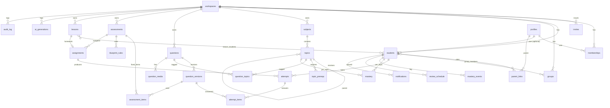

# Модель данных TutorLab

Postgres 16 (Supabase). Все доменные таблицы несут `workspace_id`, `created_at`, `updated_at`. Идентификаторы — `uuid` (`gen_random_uuid()`). Мягкое удаление только там, где нужна история: `questions`, `students`.

## ER-диаграмма

## Таблицы

### Аккаунты и доступ

**profiles** — зеркало `auth.users`. `id uuid pk = auth.users.id`, `display_name`, `locale ('ru'|'en'|'uz')`, `timezone`, `avatar_path`. Минимум персональных данных: без телефона, адреса, даты рождения.

**workspaces** — `id`, `name`, `slug unique`, `owner_id → profiles`, `ai_budget_cents int default 500`, `ai_spent_cents int`, `settings jsonb` (часовой пояс отчётов, дефолтный язык контента).

**memberships** — `workspace_id`, `user_id`, `role enum(owner,tutor,student,parent)`, `pk(workspace_id,user_id)`. Единственный источник правды о роли; попадает в JWT-клейм `workspaces` через Auth Hook.

**invites** — `id`, `workspace_id`, `code varchar(12) unique`, `role`, `student_id?` (инвайт для конкретного ученика), `expires_at`, `used_by?`, `used_at?`. Одноразовые.

**students** — учебный профиль: `id`, `workspace_id`, `user_id? → profiles` (null, пока ученик не принял инвайт), `display_name`, `grade smallint 6..11`, `track enum(school,exam,sat,mixed)`, `subjects text[]` (коды предметов), `contact_email` (email родителя или ученика), `notes` (только репетитор), `archived_at?`.

**parent_links** — `parent_user_id`, `student_id`, `workspace_id`, `pk(parent_user_id, student_id)`.

**groups**, **group_members** — группы учеников для массового назначения.

### Каталог содержания

**subjects** — `id`, `workspace_id? null = глобальный сид`, `code ('MATH','PHYS','SAT'...)`, `name_i18n jsonb`, `sort`.

**topics** — дерево. `id`, `subject_id`, `parent_id?`, `code unique per workspace (MATH.9.ALGEBRA.QUADRATIC_EQUATIONS)`, `path ltree` (для быстрых поддеревьев), `name_i18n jsonb`, `grade smallint?` (null для SAT), `depth`, `sort`, `is_sat bool`. Расширение `ltree` включено.

**topic_prereqs** — `topic_id`, `requires_topic_id`, `weight numeric(3,2) default 1.0`. Ациклический граф, проверяется триггером.

### Банк вопросов

**questions** — «карточка»: `id`, `workspace_id`, `type enum(single_choice,multiple_choice,numeric,short_text,matching,ordering,cloze,free_text)`, `status enum(draft,review,published,archived)`, `source enum(manual,ai,imported)`, `difficulty smallint 1..5`, `elo_difficulty numeric default 0` (калибруется моделью усвоения), `grade smallint?`, `language`, `tags text[]`, `current_version_id → question_versions`, `content_hash text` (нормализованный текст, для дедупа), `author_id`, `ai_generation_id?`, `deleted_at?`. Индексы: `gin(tags)`, `gin(content_hash gin_trgm_ops)`, полнотекстовый `tsvector` по тексту текущей версии.

**question_versions** — неизменяемые: `id`, `question_id`, `version int`, `stem_md text` (Markdown + LaTeX), `options jsonb` (для choice/matching/ordering/cloze), `answer jsonb` (структура зависит от типа, см. ниже), `explanation_md`, `rubric jsonb?` (для free_text), `created_by`, `created_at`. Правка опубликованного вопроса = новая версия и обновление `questions.current_version_id`. Старые попытки хранят ссылку на свою версию.

Формат `answer` по типам:

| type | answer |
|---|---|
| single_choice | `{correct: "b"}` |
| multiple_choice | `{correct: ["a","c"], partial: true}` |
| numeric | `{value: 12.5, tolerance: 0.01, unit: "см", alt: [25/2]}` |
| short_text | `{accepted: ["ромб","rhombus"], normalize: {case:true, spaces:true, yo:true}}` |
| matching | `{pairs: [["1","b"],["2","a"]]}` |
| ordering | `{order: ["c","a","b"]}` |
| cloze | `{blanks: {"1": ["x=2","2"], "2": ["-3"]}}` |
| free_text | `{rubric: [{criterion, points}], max_points: 5}` |

**question_topics** — `question_id`, `topic_id`, `is_primary bool`.

**question_media** — `question_id`, `storage_path`, `kind (image)`, `alt`, `width`, `height`. Приватный бакет, подписанные ссылки на 1 час.

### Тесты и прохождение

**assessments** — `id`, `workspace_id`, `title`, `kind enum(fixed,blueprint)`, `settings jsonb`: `{shuffle_questions, shuffle_options, time_limit_min?, max_attempts, show_answers: 'immediately'|'after_deadline'|'never', pass_percent, weights?}`. `status enum(draft,ready,archived)`.

**assessment_items** — для `fixed`: `assessment_id`, `question_version_id`, `sort`, `weight numeric default 1`.

**blueprint_rules** — для `blueprint`: `assessment_id`, `topic_id`, `include_subtree bool`, `count int`, `difficulty_min`, `difficulty_max`, `types text[]?`, `sort`. Генератор варианта берёт по каждому правилу `count` случайных опубликованных вопросов (seed = attempt id), исключая те, что ученик уже видел за последние 30 дней, если хватает банка.

**assignments** — `id`, `assessment_id`, `student_id? | group_id?` (ровно одно), `due_at?`, `available_from`, `lesson_id?`, `created_by`. При назначении группе строки материализуются по одному на ученика (для простых RLS и отчётов) с общим `batch_id`.

**attempts** — `id`, `assignment_id`, `student_id`, `attempt_no`, `started_at timestamptz default now()`, `submitted_at?`, `deadline_at` (вычислено на старте по серверным часам), `status enum(in_progress,submitted,graded,needs_review)`, `score numeric`, `max_score numeric`, `percent numeric`, `variant_seed`, `client_meta jsonb` (user agent, для отладки). Уникальность `(assignment_id, student_id, attempt_no)`.

**attempt_items** — `attempt_id`, `question_version_id`, `sort`, `answer jsonb` (черновик автосохранения и финальный), `answered_at`, `score numeric?`, `max_score`, `is_correct bool?`, `ai_grade jsonb?` `{points, confidence, reasoning, model, prompt_version}`, `tutor_override jsonb?` `{points, comment, by, at}`, `time_spent_sec`. Уникальность `(attempt_id, question_version_id)`.

### Усвоение и рекомендации

**mastery** — `student_id`, `topic_id`, `theta numeric` (латентный уровень), `n_attempts int`, `n_correct int`, `last_attempt_at`, `mastery smallint 0..100` (кэш), `ci_low`, `ci_high`, `updated_at`, `pk(student_id, topic_id)`.

**mastery_events** — журнал обновлений: `student_id`, `topic_id`, `attempt_item_id`, `theta_before`, `theta_after`, `difficulty`, `is_correct`, `created_at`. Нужен для пересчёта при смене формулы и для графиков динамики.

**review_schedule** — интервальное повторение: `student_id`, `topic_id`, `interval_days`, `ease numeric default 2.5`, `due_at`, `repetitions int`.

### Уроки и уведомления

**lessons** — `id`, `workspace_id`, `starts_at`, `duration_min`, `status enum(planned,done,cancelled)`, `topic_ids uuid[]`, `note_md`, `call_url`, `materials jsonb[]` (storage paths), `homework_assignment_id?`.

**lesson_students** — `lesson_id`, `student_id`.

**notifications** — `id`, `user_id`, `kind enum(assigned,due_soon,graded,weekly_report,lesson_reminder)`, `payload jsonb`, `channel enum(email,push)`, `sent_at?`, `read_at?`. **notification_prefs** — `user_id`, `kind`, `enabled`.

### ИИ и аудит

**ai_generations** — `id`, `workspace_id`, `requested_by`, `kind enum(generate,solve_check,grade,parse_import,feedback)`, `prompt_name`, `prompt_version`, `model`, `input jsonb` (без персональных данных ученика — только идентификаторы), `output_summary jsonb` `{requested, produced, passed_schema, passed_solve, deduped, published}`, `input_tokens`, `output_tokens`, `cost_cents numeric`, `latency_ms`, `status enum(queued,running,done,failed)`, `error?`.

**audit_log** — `id`, `workspace_id`, `actor_id`, `action` (`grade.override`, `question.delete`, `student.export`, `student.delete`...), `entity`, `entity_id`, `diff jsonb`, `created_at`. Только вставка, без обновлений (политика RLS).

## Представления и функции

- `question_public` — view для ученика: версия без `answer`, `explanation_md`, `rubric`. RLS на `question_versions` запрещает `student` прямой `select`.
- `auth.workspace_ids()` — `security definer` функция: воркспейсы текущего пользователя из `memberships`.
- `auth.student_ids()` — ученики, к которым у пользователя есть доступ (свой `students.user_id` или через `parent_links`).
- `fn_submit_attempt(attempt_id)` — не используется; скоринг делает приложение в транзакции, чтобы логика была в TypeScript и покрыта unit-тестами. В БД остаётся только защита: триггер, запрещающий изменение `attempt_items.answer` после `submitted_at`.

## Политики RLS (сводка)

| Таблица | tutor/owner | student | parent |
|---|---|---|---|
| students | CRUD в своём workspace | select своей строки | select детей |
| questions, question_versions | CRUD | нет доступа (только view `question_public` для вопросов из своих попыток) | нет |
| assignments | CRUD | select своих | select детей |
| attempts, attempt_items | select/update (override) | select/insert/update своих до `submitted_at` | select детей |
| mastery, mastery_events | select | select своих | select детей |
| lessons | CRUD | select своих | select детей |
| ai_generations, audit_log | select (audit: insert через сервис) | нет | нет |

## Сиды

`db/seeds/curriculum/*.json` — предметы и темы: математика/алгебра/геометрия 6–11, физика 7–11, химия 8–11, биология 6–11, русский 6–11, английский 6–11, история 6–11, SAT (8 доменов с поддоменами). Формат: `{code, parent, grade, name: {ru,en,uz}, prereqs: [codes]}`. Правятся руками, загружаются `pnpm db:seed`. Демо-набор: 1 репетитор, 8 учеников, 3 месяца попыток — генерируется скриптом с фиксированным seed, чтобы дашборды были воспроизводимы.
